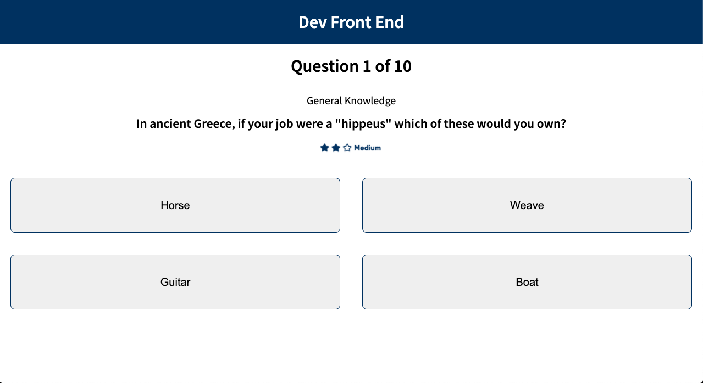

<p align="center">

  <h2 align="center">Quiz Test</h2>

  <p align="center">
    <br />
    <small>A simple test with ScoreBoard</small>
    <br />
    <br />

  </p>
</p>

## Contents

- [Contents](#contents)
- [About The Project](#about-the-project)
  - [Built With](#built-with)
- [Getting Started](#getting-started)
  - [Installation](#installation)
- [Contributing](#contributing)
- [Screenshots](#screenshots)
- [Contact](#contact)

## About The Project

<p align="center">
  
</p>

<br />

### Built With

-   [ReactJS - v.13.13.1](https://pt-br.reactjs.org/)
-   [React Router Dom - v.5.2.0 ](https://reactrouter.com/)
-   [Immer - v.7.0.9](https://immerjs.github.io/immer/docs/introduction)
-   [Firebase - v.7.21.1](http://firebase.google.com/)
-   [Axios - v.0.20.0](https://github.com/axios/axios)
-   [Redux - v.4.0.5](https://redux.js.org/)
-   [React-Modal - v.3.11.2](https://www.npmjs.com/package/react-modal#api-documentations)

## Getting Started

To get a local copy up and running follow these simple steps.

### Installation

1. Clone the repo

```sh
git clone https://github.com/felipealvescosta/quiztest
```

2. Open the .env.example file, update to .env and paste the firebase credentials.
   Save, and proceed to the next step.

3. Install packages

```sh
yarn install
```

4. Run Project

```sh
yarn start
```

5. Run Tests

```sh
yarn jest
```

## Contributing

Contributions are what make the open source community such an amazing place to be learn, inspire, and create. Any contributions you make are **greatly appreciated**.

1. Fork the Project
2. Create your Feature Branch (`git checkout -b feature/YourFeature`)
3. Commit your Changes (`git commit -m 'Add some YourFeature'`)
4. Push to the Branch (`git push origin feature/YourFeature`)
5. Open a Pull Request

## Screenshots

<p align="center">
  
</p>

## Contact

[Felipe Alves](https://felipealvescosta.com) - [LinkedIn](https://www.linkedin.com/in/felipealvesdacosta/) - [GitHub](https://github.com/felipealvescosta)
